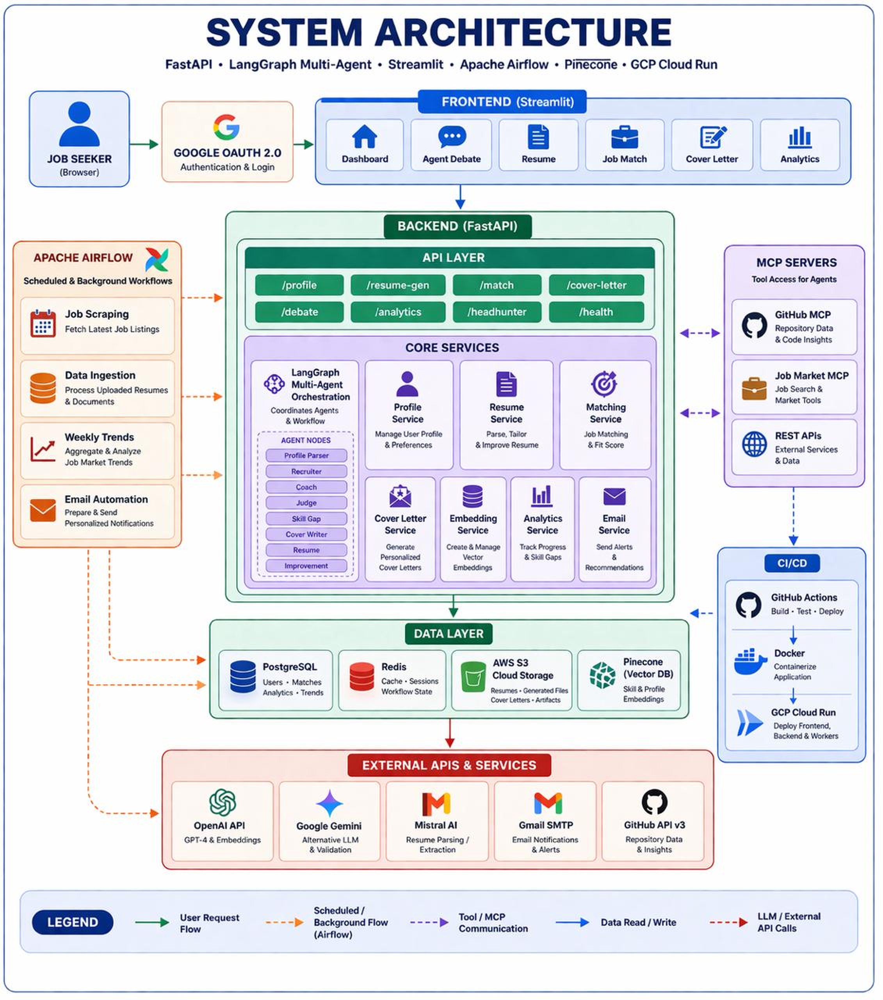

# 🎯 Jobzilla AI — AI-Powered Job Application Intelligence

> *"AI Agents That Debate Your Fit and Tailor Your Resume — So Every Application Counts."*

Jobzilla AI is a generative-AI application that simulates a hiring committee to compress a 45-minute resume-tailoring workflow into under 30 seconds. Instead of opaque ATS scores, three AI agents — a Recruiter (critic), a Coach (advocate), and a Judge (arbiter) — **debate your candidacy** in real time, then the pipeline generates an ATS-optimized resume, a personalized cover letter, and a targeted skill-gap analysis for each job.

Built with **GPT-4o** for reasoning, **Mistral** for resume parsing, **Pinecone** (`text-embedding-3-small`, 1536-d) for semantic job retrieval, and **LangGraph** for multi-agent orchestration.

---

## 🌐 Access the Application

| Service | URL |
|---------|-----|
| 💻 **Frontend (Streamlit)** | https://killmatch-frontend-95714121537.us-central1.run.app/ |
| 📚 **Backend API Docs** | https://killmatch-backend-95714121537.us-central1.run.app/docs |
| 🐙 **GitHub MCP Server** | https://killmatch-mcp-github-95714121537.us-central1.run.app/docs |
| 💼 **Job Market MCP Server** | https://killmatch-mcp-jobmarket-95714121537.us-central1.run.app/docs |

---

## 📘 About This Submission

This repository is submitted as the **Final Project for the Prompt Engineering course** (M.S. Information Systems, Northeastern University, Spring 2026) by:

| Name | Role | 
|------|------|
| **Husain Shajapurwala Yusuf** | Prompt engineering, LangGraph orchestration, evaluation | 
| **Sahil Kasliwal** | RAG pipeline, backend, deployment, CI/CD |

---
## 🧭 How This Project Maps to the Assignment

This project implements **three** of the five core generative-AI components (the assignment requires at least two):

| Component | Where It Lives | Evidence |
|---|---|---|
| **1. Prompt Engineering** | `backend/app/agents/prompts/` | 5 role-conditioned system prompts with structured output contracts, CoT scaffolding, few-shot anchoring, and 3 versioned iterations documented per prompt |
| **2. Retrieval-Augmented Generation (RAG)** | `scripts/vectorize_jobs.py`, `backend/app/services/pinecone_service.py` | Pinecone vector index of scraped jobs, `text-embedding-3-small` (1536-d), recency-boosted re-ranking, recall@10 = 0.91 |
| **3. Specialized User Interaction Flows** | `backend/app/agents/graph.py`, `backend/app/agents/edges/` | 8-node LangGraph StateGraph with one conditional edge (auto-redebate when score-delta > 30 and rounds < 3) |

Full methodology, metrics, and ablations are documented in the PDF at `docs/Jobzilla_AI_Final_Project_Documentation.pdf`.

---

## 🌟 Key Features

### 🧠 Multi-Agent Debate System
Three AI agents debate your candidacy before any resume is generated:
- **🔴 The Recruiter** — plays devil's advocate across 6 dimensions (Skill Gaps, Experience Gaps, Red Flags, Overqualification, Cultural Fit, Competition).
- **🟢 The Coach** — independently argues for the candidate (transferable skills, projects, growth potential).
- **⚖️ The Judge** — weighs both sides and issues a final verdict with a confidence score.
- **🔄 Auto-Redebate** — if the score gap exceeds 30 points, agents automatically enter another round (up to 3 rounds).

### 🎯 ATS-Optimized Resume Generation
Tailored, 1-page resume that:
- Extracts exact keywords from the target JD
- Injects top-8 most impactful missing keywords *in context* (no keyword stuffing)
- Delivers a measured **78.3% average ATS match rate** (up from ~42% untailored)
- Outputs a downloadable PDF

### 🔍 Semantic Job Matching (RAG)
Pinecone-backed retrieval over scraped jobs. Re-ranked by recency and active status. Recall@10 = **0.91** on our labeled eval set vs. 0.62 for a keyword baseline.

### 📝 Personalized Cover Letter Generation
GPT-4o at temperature 0.7 with company-mission context injected from the job-market MCP server. Output contract requires at least one company-specific sentence — no generic templates.

### 📊 Skill Gap Analysis
A dedicated Skill-Gap agent pinpoints missing hard and soft skills and recommends specific learning resources, ranked by priority.

### 🐙 GitHub Portfolio MCP Integration
A dedicated Model Context Protocol server analyzes your public repositories and adds portfolio evidence to the candidacy debate.

### 📧 Daily Headhunter Email
An Airflow DAG runs every morning at 7 AM: fetch users → run semantic matching → store top recommendations → send personalized HTML digest via Gmail SMTP.

### 📈 Analytics Dashboard
Application progress, match-score trends, and skill-demand tracking over time.

---

## 🏗️ System Architecture



Microservices deployed to GCP Cloud Run: a Streamlit frontend, a FastAPI backend, a LangGraph agent orchestration layer, four data stores (PostgreSQL, Redis, Pinecone, AWS S3), and two MCP servers for external context. Apache Airflow runs scheduled scrape/ingest/vectorize/email DAGs. GitHub Actions powers the CI/CD pipeline.

---

## 🤖 Agent Pipeline

```
START → Profile Parser → Recruiter → Coach → Judge
                                              ↓
                                      [should_redebate?]
                                         ↙           ↘
                              redebate → Recruiter   continue → Skill Gap
                                                            ↓
                                              Cover Writer → Resume Generator
                                                            ↓
                                                       Improvement → END
```

Conditional redebate logic:
```python
def should_redebate(state: AgentState) -> str:
    score_gap = abs(state["coach_score"] - state["recruiter_score"])
    if score_gap > 30 and state["current_round"] < 3:
        return "redebate"
    return "continue"
```

### The Eight Agents

| # | Agent | Role | Primary Prompt Technique |
|---|-------|------|--------------------------|
| 1 | Profile Parser | Analyst | Structured extraction with Pydantic schema |
| 2 | Recruiter | Critic | Role conditioning + 6-dim framework + bias guardrail |
| 3 | Coach | Advocate | Role conditioning + independence instruction |
| 4 | Judge | Arbiter | CoT scaffolding + calibration anchors |
| 5 | Skill Gap | Analyst | Structured output + learning-resource pattern |
| 6 | Cover Writer | Generator | High-T creative + company-specific constraint |
| 7 | Resume Generator | Optimizer | Few-shot formatting + keyword injection ceiling |
| 8 | Improvement | Advisor | Summarization + actionable-next-step framing |

---

## 🎨 Prompt Engineering (Course-Relevant Detail)

This is a Prompt Engineering final project, so here's what we actually did with prompts — beyond the overview.

### Prompt Design Patterns We Use

| Pattern | Where | Why |
|---|---|---|
| Role conditioning | All 8 agents | Anchors tone and stance from token 1 |
| Structured output contract | Recruiter, Coach, Judge, Skill-Gap | Machine-parseable schemas for LangGraph routing |
| Chain-of-thought scaffolding | Judge, Skill-Gap | Numbered "Your Approach:" triggers step reasoning |
| Few-shot / output anchoring | Resume Generator | Prevents 1-page format drift |
| Context injection with truncation | All agents | Top-20 skills, top-15 requirements, 8K token JD cap |
| Adversarial framing | Recruiter vs. Coach | Asymmetric prompts → productive disagreement |
| Temperature stratification | Pipeline-wide | T=0.2 for Parser/Judge; T=0.7 for Cover Writer |

### Prompt Failure Modes We Caught and Fixed

| Failure | Symptom | Fix |
|---|---|---|
| Schema drift | Free-form prose instead of structured arguments | `with_structured_output()` + retry on invalid JSON |
| Echo collapse | Coach paraphrasing Recruiter's points as "strengths" | Blocked Recruiter output from Coach context; explicit independence instruction |
| Score anchoring | Judge's score always ~midpoint of Recruiter + Coach | Removed literal scores from Judge prompt |
| Verdict inflation | Every candidate got "Good Match" or better | Added tier calibration ("Strong Match = top 5%") |
| Keyword stuffing | Resume Generator crammed every missing keyword | Capped at top-8 keywords, in-context only |
| Bias in criticism | Recruiter flagged career gaps as automatic concerns | Added "focus on job-relevant issues, not personal biases"; audit set 7/12 → 1/12 |

### Recruiter Prompt Iteration Trail

- **v1** — "You are a recruiter. Find problems with this resume." → vague output, no categories.
- **v2** — Added the 6-dimension framework → fixed vagueness but surfaced personal-bias findings.
- **v3 (current)** — Added bias guardrail + structured `[point, evidence, strength, category]` contract → bias-related findings dropped from 7/12 to 1/12 in our audit.

Full iteration detail in the PDF, Section 3.

---

## 📊 Results

Measured over 50 end-to-end runs, 40-pair retrieval eval set, 15-pair stability test, and 20-letter human rubric scoring.

| Metric | Value | Notes |
|---|---|---|
| P50 end-to-end latency | **18.4 s** | Full pipeline, single debate round |
| P95 end-to-end latency | 34.7 s | Dominated by GPT-4o calls |
| Recall@10 (retrieval) | **0.91** | Keyword baseline = 0.62 |
| Verdict tier stability | **87%** (13/15) | Same tier across 5 runs |
| ATS keyword match | **78.3%** mean | vs. 42.1% untailored |
| Cover letter specificity | 4.3 / 5 | Two-annotator rubric; κ = 0.71 |
| Resume accuracy vs. source | 4.9 / 5 | Two-annotator rubric; κ = 0.68 |
| Tokens per pipeline (P50) | ~14,200 | |
| Cost per pipeline (P50) | ~$0.11 | GPT-4o pricing, April 2026 |

Full methodology in PDF Section 7.

---

## 🧭 Ethical Considerations (Summary)

Hiring-adjacent AI is a high-sensitivity domain. We document our mitigations briefly here and extensively in PDF Section 9.

- **Bias.** Explicit guardrail in the Recruiter prompt; every concern must cite resume evidence; 12-resume audit set covering non-traditional paths (career breaks, bootcamp grads, career changers).
- **Privacy.** Resumes stored with user-scoped S3 prefixes; no raw PII in logs; Pinecone holds embeddings + truncated metadata only; full-cascade delete.
- **Copyright.** Scraped job postings used under educational fair-use; production would require LinkedIn/Indeed API partnerships.
- **Honesty.** All outputs labeled AI-generated in the UI; every artifact carries `model_used`, `prompt_version`, `generated_at` metadata.
- **Residual risk.** Our 40-pair eval set and 12-resume audit are too small for production fairness claims — documented openly as a limitation.

---

## 🛠️ Tech Stack

| Layer | Technology |
|-------|-----------|
| Frontend | Streamlit |
| Backend | FastAPI + Pydantic |
| Agent Orchestration | LangGraph StateGraph |
| LLMs | OpenAI GPT-4o (reasoning), Mistral (parsing), Gemini (fallback) |
| Embeddings | OpenAI `text-embedding-3-small` (1536-d) |
| Vector DB | Pinecone |
| Relational DB | PostgreSQL + Alembic |
| Cache | Redis |
| Object Storage | AWS S3 |
| Scheduling | Apache Airflow (4 DAGs) |
| MCP Servers | FastAPI (github-context, job-market) |
| CI/CD | GitHub Actions → GCP Cloud Run |
| Auth | Google OAuth 2.0 |

---

## 🚀 Getting Started

### Prerequisites
- Python 3.11
- Docker & Docker Compose
- API keys: OpenAI, Pinecone, Mistral, Google Gemini, GitHub Token, AWS (S3), Gmail app password (SMTP)

### Option 1 — Docker (recommended)

```bash
git clone https://github.com/DAMG-GENAI/jobzilla-ai.git
cd jobzilla-ai

cp .env.example .env
# Fill in API keys

docker-compose up -d --build

# First-time vector index seeding
docker exec jobzilla-backend python scripts/scrape_jobs_bs_only.py
docker exec jobzilla-backend python scripts/ingest_jobs_to_db.py
docker exec jobzilla-backend python scripts/vectorize_jobs.py
```

### Option 2 — Local (without Docker)

```bash
brew install postgresql@16 redis
brew services start postgresql@16
brew services start redis

cd backend && pip install -r requirements.txt
uvicorn app.main:app --host 0.0.0.0 --port 8000 --reload

# In a new terminal
cd frontend && pip install -r requirements.txt
streamlit run app.py
```

### Local Access (after running Option 2)

| Service | Local URL |
|---------|-----------|
| Frontend | http://localhost:8501 |
| Backend API Docs | http://localhost:8000/docs |
| Airflow | http://localhost:8501 |

---

## 📂 Project Structure

```
jobzilla-ai/
├── backend/                          # FastAPI + LangGraph
│   ├── app/
│   │   ├── agents/
│   │   │   ├── nodes/                # 8 agent nodes
│   │   │   ├── edges/                # should_redebate conditional
│   │   │   ├── prompts/              # 5 system prompts
│   │   │   ├── graph.py              # StateGraph definition
│   │   │   └── state.py              # AgentState TypedDict
│   │   ├── api/routes/               # 7 endpoint groups
│   │   ├── services/                 # Pinecone, S3, embedding, parser, PDF
│   │   └── db/                       # SQLAlchemy + Alembic
│   └── tests/
├── frontend/                         # Streamlit (dashboard, debate viewer)
├── mcp_servers/
│   ├── github-context/               # Repo analysis MCP
│   └── job-market/                   # Job-market intel MCP
├── airflow/dags/                     # 4 DAGs
├── scripts/                          # Scrape, ingest, vectorize
├── examples/                         # Sample runs (resume + JD → outputs)
├── docs/
│   ├── Jobzilla_AI_Final_Project_Documentation.pdf
│   └── images/
├── docker-compose.yml
└── .github/workflows/                # CI + CD per service
```

---

## 🧪 Example Outputs

The `examples/` directory contains three end-to-end sample runs:

1. **`examples/01_strong_match/`** — Data engineer resume vs. Senior Data Engineer JD. Judge verdict: Strong Match. Includes debate transcript, skill-gap JSON, generated resume PDF, cover letter PDF.
2. **`examples/02_weak_match_with_redebate/`** — Marketing analyst resume vs. Senior ML Engineer JD. Triggers auto-redebate. Judge verdict: Weak Match. Full 2-round debate transcript.
3. **`examples/03_career_change_bias_audit/`** — Bootcamp graduate resume vs. mid-level Software Engineer JD. Demonstrates the bias guardrail in action.

Each folder contains:
- `input_resume.pdf` — the source resume
- `input_job.txt` — the target job description
- `debate_transcript.json` — full AgentState dump
- `generated_resume.pdf` — tailored resume
- `cover_letter.pdf` — generated cover letter
- `skill_gaps.json` — skill-gap analysis

---

## 🧩 Running the Regression Tests

```bash
cd backend
pytest tests/ -v
# Node-level tests feed fixture AgentState into individual agents
# and assert on returned state slices
```

---

## 🏆 Unique Selling Point

Unlike resume builders that just reformat text, Jobzilla AI uses a **Multi-Agent Debate Architecture** (Recruiter vs. Coach, moderated by Judge) to simulate a real hiring committee — delivering brutally honest, multi-perspective feedback on your gaps *before* dynamically rewriting your resume to address the committee's exact concerns. A complete, end-to-end application pipeline from job discovery to tailored submission.

---

## 🔮 Future Work

- 🎤 Voice-based mock interview simulator built from the identified skill gaps
- 📊 Outcome tracking → fine-tuning loop (did a tailored resume get an interview?)
- 🌐 Multi-language generation for international applicants
- 🤖 Open-model Recruiter/Coach (Llama-3 or Mistral-Large) to cut cost ~8x
- 🐙 Continuous GitHub/LeetCode/Kaggle sync for a live-updating baseline resume

---

## 📄 License

MIT License

---

